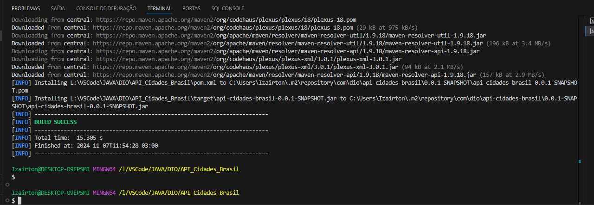
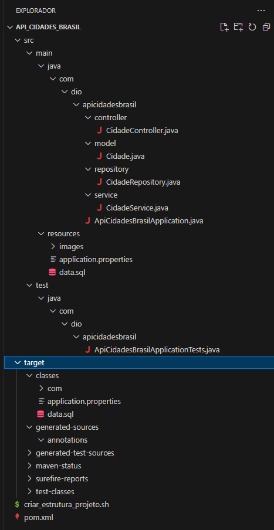
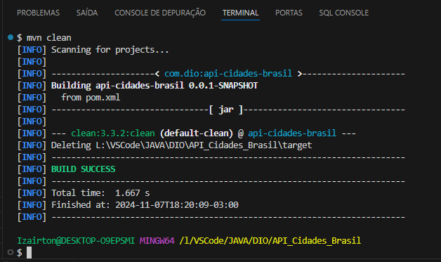
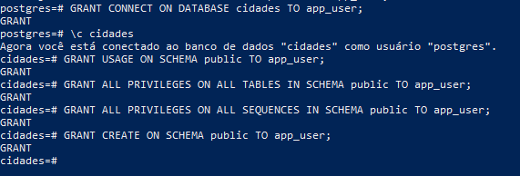
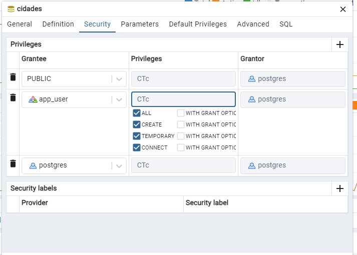
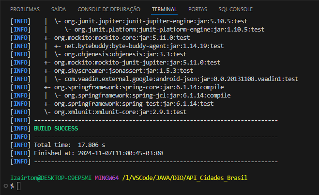
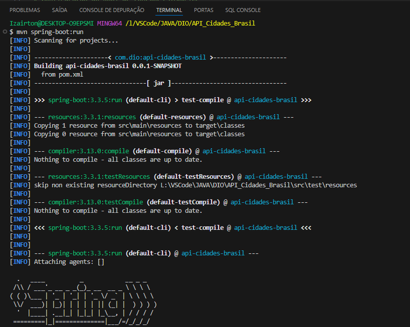
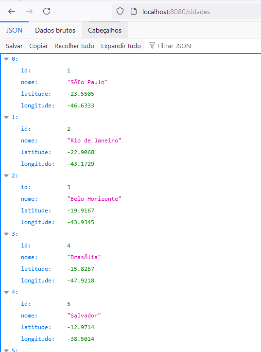
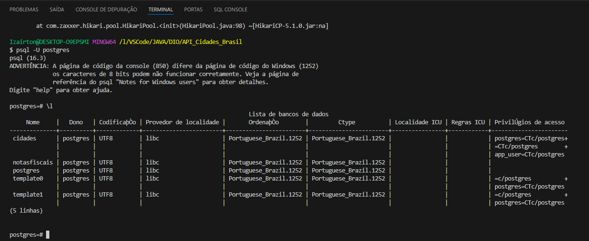

# API Cidades Brasil

API Rest para consulta de informações sobre cidades brasileiras. Desenvolvido como parte de um projeto educacional com o objetivo de explorar a implementação de uma API RESTful utilizando Spring Boot e PostgreSQL.

## Objetivos do Projeto

- Implementar uma API REST para consulta de cidades, incluindo informações como nome, latitude e longitude.
- Praticar a criação e configuração de um banco de dados PostgreSQL para armazenar dados geográficos.
- Configurar o ambiente de desenvolvimento com Maven, Spring Boot, JPA, e HikariCP.
- Explorar configurações de codificação UTF-8 para suportar caracteres acentuados no projeto.

## Tecnologias Utilizadas

1. Java 17 - Linguagem de programação utilizada para o desenvolvimento do projeto.
2. Spring Boot 3.3.5 - Framework principal para a construção da API.
3. Spring Data JPA - Abstração de acesso ao banco de dados.
4. Hibernate - Implementação de JPA utilizada no projeto.
5. PostgreSQL - Banco de dados utilizado para armazenar as informações sobre cidades.
6. HikariCP - Pool de conexões para otimizar o gerenciamento de conexões com o banco de dados.
7. Maven - Ferramenta de build e gerenciamento de dependências.

## Estrutura do Projeto

    API_Cidades_Brasil/
    ├── src/
    │   ├── main/
    │   │   ├── java/com/dio/apicidadesbrasil/
    │   │   │   ├── ApiCidadesBrasilApplication.java   # Classe principal do Spring Boot
    │   │   │   ├── model/                            # Classes de modelo
    │   │   │   │   └── Cidade.java                   # Entidade Cidade
    │   │   │   ├── repository/                       # Repositório de dados
    │   │   │   │   └── CidadeRepository.java         # Interface JPA para Cidade
    │   │   │   ├── controller/                       # Controlador de endpoints
    │   │   │   │   └── CidadeController.java         # Endpoints para Cidade
    │   ├── resources/
    │   │   ├── application.properties                # Configurações da aplicação
    │   │   ├── static/                               # Arquivos estáticos (se aplicável)
    │   │   └── templates/                            # Templates para visualizações (se aplicável)
    ├── .gitignore
    ├── pom.xml                                       # Arquivo de configuração Maven
    └── README.md                                     # Documentação do projeto

## Endpoints da API

    Método-Endpoint-Descrição

    GET-/cidades-Retorna todas as cidades
    GET-/cidades/{id}-Retorna uma cidade por ID

### Exemplo de resposta JSON para o endpoint /cidades

    [
        {
            "id": 1,
            "nome": "Sao Paulo",
            "latitude": -23.5505,
            "longitude": -46.6333
        },
        {
            "id": 2,
            "nome": "Rio de Janeiro",
            "latitude": -22.9068,
            "longitude": -43.1729
        }
    ]

## Configurações do Banco de Dados

Certifique-se de que o PostgreSQL esteja instalado e configurado com um banco de dados chamado cidades. Utilize as credenciais definidas no arquivo application.properties:

spring.datasource.url=jdbc:postgresql://localhost:5432/cidades
spring.datasource.username=app_user
spring.datasource.password=123mar

Certifique-se também de que o banco de dados está usando a codificação UTF-8 para suportar caracteres acentuados.

## Comandos Utilizados

### Compilação e Execução do Projeto

1. Para compilar o projeto:

    mvn clean install

2. Para executar o projeto:

    mvn spring-boot:run

3. Acesse a aplicação em: <http://localhost:8080/cidades>

### Banco de Dados PostgreSQL

1. Criar o banco de dados:

    CREATE DATABASE cidades WITH ENCODING 'UTF8';

2. Criar a tabela e inserir os dados diretamente:

    CREATE TABLE IF NOT EXISTS cidade (
        id SERIAL PRIMARY KEY,
        nome VARCHAR(255) NOT NULL,
        latitude DOUBLE PRECISION,
        longitude DOUBLE PRECISION
    );

    INSERT INTO cidade (nome, latitude, longitude) VALUES
    ('Sao Paulo', -23.5505, -46.6333),
    ('Rio de Janeiro', -22.9068, -43.1729),
    ('Belo Horizonte', -19.9167, -43.9345),
    ('Brasilia', -15.8267, -47.9218),
    ('Salvador', -12.9714, -38.5014),
    ('Curitiba', -25.4284, -49.2733),
    ('Fortaleza', -3.7172, -38.5434),
    ('Manaus', -3.1190, -60.0217),
    ('Recife', -8.0476, -34.8770),
    ('Porto Alegre', -30.0331, -51.23);

## Almumas imagens do Projeto

Aqui estão algumas imagens capturadas durante o processo de desenvolvimento e configuração do projeto.

### Compilando o Projeto

### Estrutura

### Limpando com Maven

### Concedendo Permissões no PostgreSQL

### Concedendo Permissões no pgAdmin

### Verificando Dependências

### Rodando Spring Boot

### Acessando Endpoint no Navegador

### Confirmando Criação do Banco de Dados

## Recomendações Futuras para Melhoramento do Projeto

1. **Paginação e Filtros:** Implementar paginação nos endpoints para otimizar o retorno de dados em APIs com muitas cidades.
2. **Cache:** Adicionar caching para melhorar o desempenho e reduzir a carga no banco de dados para dados estáticos.
3. **Autenticação e Autorização:** Implementar segurança na API usando OAuth2, JWT ou Spring Security para proteger endpoints.
4. **Documentação com Swagger:** Integrar o Swagger para documentar automaticamente a API, tornando-a mais acessível para desenvolvedores que utilizarem o serviço.
5. **Validação de Dados:** Incluir validações mais robustas nas entradas dos endpoints para garantir integridade e segurança dos dados.
6. **Testes Unitários e de Integração:** Expandir a cobertura de testes, incluindo testes unitários e de integração para assegurar a qualidade e confiabilidade do código.
7. **Containers e CI/CD:** Dockerizar a aplicação e configurar pipelines de integração e entrega contínuas (CI/CD) para facilitar a implantação em ambientes de produção.

## Conclusão

Este projeto demonstrou a criação de uma API REST para consulta de cidades brasileiras, utilizando Spring Boot e PostgreSQL. Desde a configuração do banco de dados até o desenvolvimento dos endpoints, cada etapa permitiu uma visão prática das melhores práticas no desenvolvimento de APIs com Java e integração com bancos de dados relacionais.

Além de fornecer funcionalidades essenciais de consulta geográfica, este projeto estabelece uma base sólida para futuras expansões e melhorias, como adicionar mais endpoints, implementar autenticação e autorização, e otimizar a performance. A documentação e imagens de desenvolvimento incluídas neste README foram projetadas para facilitar o entendimento e o processo de configuração, servindo como uma referência tanto para novos desenvolvedores quanto para quem deseja aprimorar a aplicação.

Este projeto é um ótimo exemplo de como construir uma API simples, porém eficaz, e reforça a importância de boas práticas, como versionamento de código e uso de arquivos de configuração (`.gitignore`). Esperamos que este projeto sirva como base e inspiração para soluções ainda mais robustas e escaláveis no futuro.
